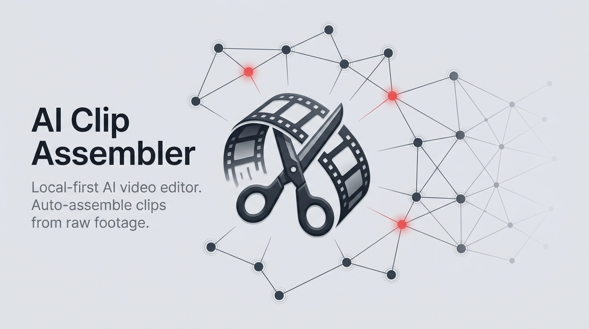
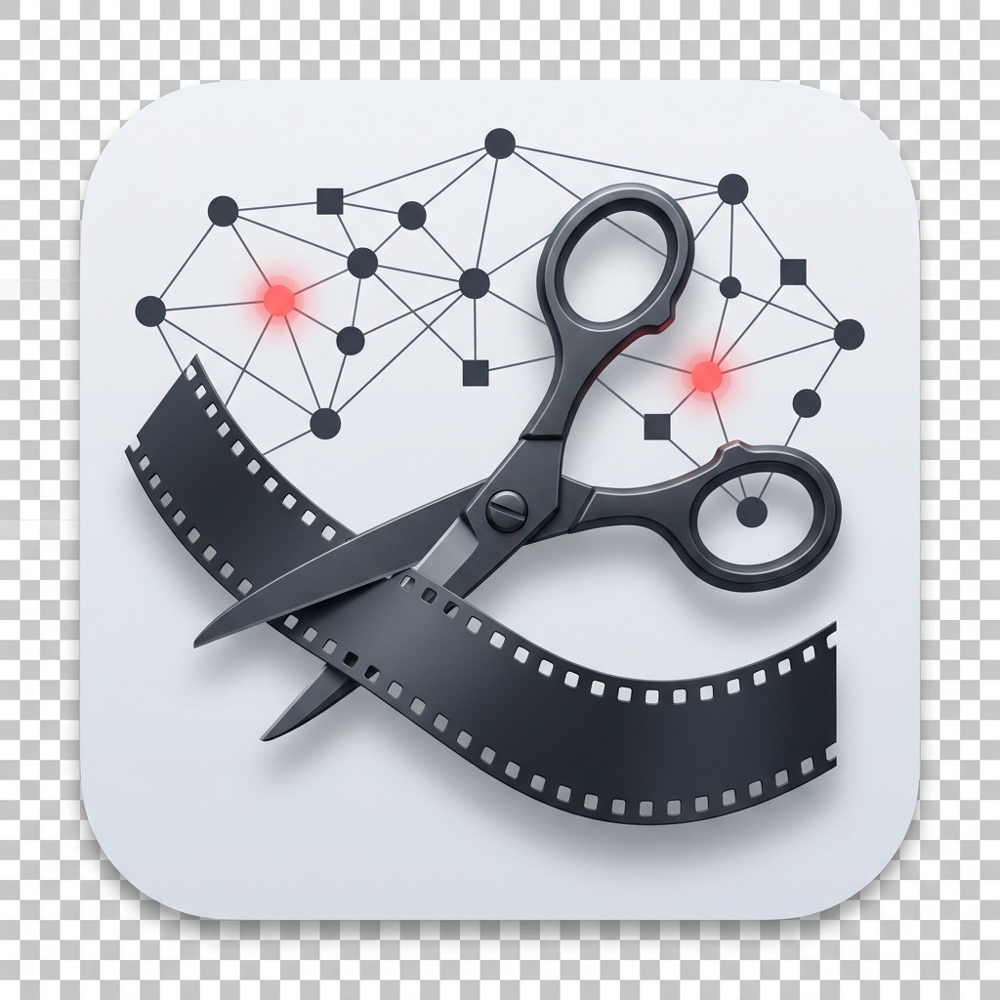

# AI Clip Assembler



AI Clip Assembler is a local-first desktop video editor for turning raw MP4 footage into a clean, editable timeline. Import a folder of clips, let the app detect and score useful moments, review the suggestions, adjust the timeline, and export to Final Cut Pro, DaVinci Resolve, or any editor that accepts EDL.

The project is built for creators who come home with long drone, action-camera, travel, or event footage and need a fast first assembly without handing private source media to a cloud service.



## The problem

Raw video review is slow. A short finished edit can start with hours of shaky, duplicated, poorly exposed, or visually uninteresting footage. Most AI video tools either hide the editing decisions, require uploading footage, or produce a final render that is hard to refine in a professional editor.

AI Clip Assembler solves the first-pass assembly problem:

- Keep footage on your machine.
- Find candidate clips using technical scoring, scene detection, motion analysis, and optional AI harnesses.
- Let the human editor accept, reject, trim, reorder, and refine the results.
- Export an editable timeline instead of a locked-in final video.

## Current status

AI Clip Assembler is an active MVP. The end-to-end drone-first workflow works locally: import, analyze, review, timeline editing, and export to DaVinci Resolve XML, FCPXML, or EDL.

The app is still early. Expect rough edges, macOS-first setup, and active changes to the project format while the editor matures.

## Features

- Local FastAPI backend for video analysis and export.
- Electron + React desktop app for import, review, timeline editing, and export.
- FFmpeg/OpenCV/PySceneDetect pipeline for frame sampling, quality scoring, scene boundaries, and motion stability.
- Pluggable AI harness system with a default `pi_agent` harness and a no-AI manual harness.
- Review board for accepting or rejecting candidate clips.
- Backend-authoritative timeline with split, retrim, reorder, speed, transform, undo, and redo support.
- Export to Final Cut Pro XML, DaVinci Resolve XML, and EDL.

## Privacy model

Footage is local by default. Source videos are processed on your machine, project data is stored as files, and there is no database service.

Optional AI harnesses may call tools or providers you configure yourself. If you use a provider-backed harness, review that provider's data policy before sending frames or metadata through it. The manual harness runs without AI.

## Tech stack

- Desktop: Electron, React, Vite, Tailwind CSS
- Backend: FastAPI, Python, FFmpeg, OpenCV, PySceneDetect
- Data: project folders, JSON metadata, FFmpeg-derived media metadata
- AI: modular harnesses for manual rules, local models, and user-chosen agent/provider workflows

## Getting started

### Prerequisites

AI Clip Assembler currently targets macOS development.

Install the system tools:

```bash
brew install python@3.11 node ffmpeg
```

FFmpeg must include the `vidstabdetect` filter for motion analysis:

```bash
ffmpeg -hide_banner -filters | grep vidstabdetect
```

If that prints nothing, your FFmpeg build does not include `libvidstab`. The standard Homebrew bottle may not include it. Build FFmpeg from the `homebrew-ffmpeg` tap instead:

```bash
brew uninstall ffmpeg
brew tap homebrew-ffmpeg/ffmpeg
brew install homebrew-ffmpeg/ffmpeg/ffmpeg --with-libvidstab
ffmpeg -hide_banner -filters | grep vidstab
```

The source build can take 10-30 minutes.

### Run the app

```bash
git clone https://github.com/evilkels/ai-clip-assembler.git
cd ai-clip-assembler
```

Set up the backend:

```bash
cd backend
python3.11 -m venv .venv
.venv/bin/pip install -r requirements.txt
```

Set up the frontend:

```bash
cd ../frontend
npm install
```

Run the backend and Electron app together:

```bash
npm run dev:with-backend
```

The backend runs on `http://127.0.0.1:8000`. The Electron app opens in development mode.

## Optional AI harness setup

The active default AI harness is `pi_agent`, which drives the [`pi`](https://github.com/earendil-works/pi-mono) coding-agent CLI to score candidate clips.

Install and authenticate it if you want AI-assisted visual-interest scoring:

```bash
npm install -g @earendil-works/pi-coding-agent
pi /login
```

You can tune the harness with environment variables such as `PI_PROVIDER`, `PI_MODEL`, `PI_BIN`, and `PI_TIMEOUT_SEC`. Put local defaults in a repo-root `.env`; use [.env.example](.env.example) as the template.

For a no-AI workflow, use the manual harness.

## Basic workflow

1. Import a folder of MP4 source footage.
2. Run analysis to detect scenes, score quality, measure motion stability, and assemble candidate clips.
3. Review candidate clips and accept the useful ones.
4. Adjust the timeline with trims, ordering, speed, and transform changes.
5. Export to FCPXML, DaVinci Resolve XML, or EDL.

See the [User Guide](docs/USER_GUIDE.md) for a fuller walkthrough.

## Development

Run backend tests:

```bash
cd backend
PYTHONPATH=. .venv/bin/python -m pytest
```

Run frontend checks:

```bash
cd frontend
npm run typecheck
npm run build
```

Run the synthetic end-to-end check from the repo root:

```bash
backend/.venv/bin/python scripts/synthetic_e2e_qa.py
```

Useful scripts from `frontend/`:

- `npm run dev:with-backend` - run backend and Electron together
- `npm run dev:backend` - run only the backend
- `npm run dev` - run only the Electron app
- `npm run test:backend` - run the backend test suite
- `npm run test:e2e` - run Playwright end-to-end tests

## Project structure

```text
ai-clip-assembler/
├── backend/      FastAPI video analysis, timeline, harness, and export code
├── frontend/     Electron + React desktop app
├── harness/      AI harness configuration and local harness docs
├── docs/         architecture, setup, QA, MCP, plans, and product docs
└── scripts/      smoke tests, synthetic QA, and benchmark helpers
```

## Documentation

- [User Guide](docs/USER_GUIDE.md) - import, review, timeline, and export workflow
- [Developer Setup](docs/DEVELOPER_SETUP.md) - local environment and test commands
- [Troubleshooting](docs/TROUBLESHOOTING.md) - common setup and runtime issues
- [Architecture](docs/ARCHITECTURE.md) - system design
- [Harness Spec](docs/HARNESS_SPEC.md) - pluggable AI harness contract
- [Media Prompt Ideas](docs/BRAND_MEDIA_PROMPTS.md) - logo, hero, and screenshot generation prompts
- [PRD](docs/PRD.md) - product requirements

## Contributing

Issues and pull requests are welcome. This project is early, so the most useful contributions are bug reports with reproducible footage/setup details, focused fixes, test coverage, export compatibility improvements, and docs that make local setup easier.

Before opening a PR, read [CONTRIBUTING.md](CONTRIBUTING.md) and run the relevant checks locally.

## Security

Please do not open a public issue for a vulnerability. See [SECURITY.md](SECURITY.md) for the reporting process.

## License

AI Clip Assembler is released under the [MIT License](LICENSE).
