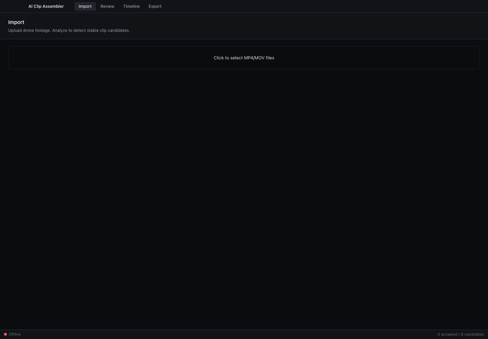
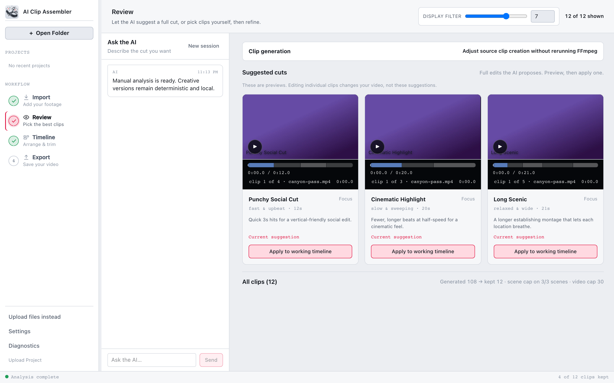
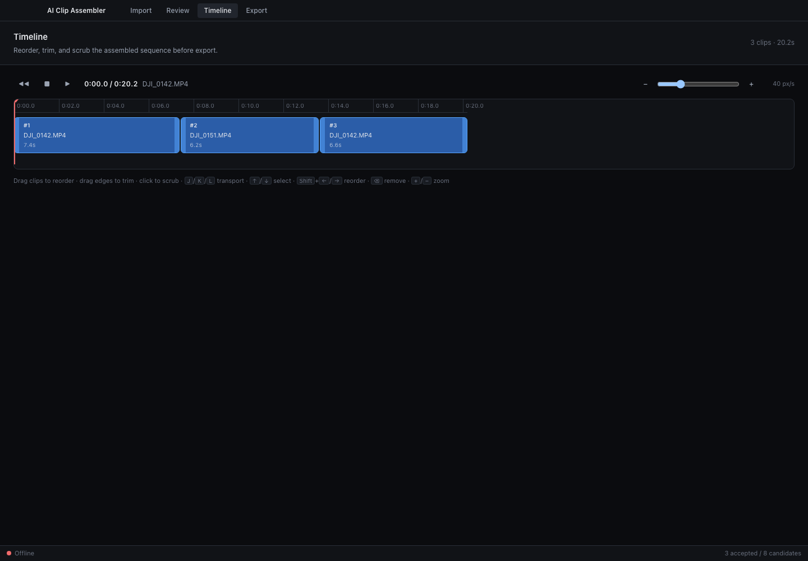
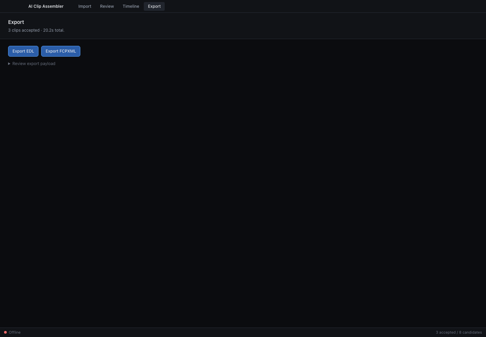

# User Guide

AI Clip Assembler turns raw drone/action footage into a tight 1–3 minute cut.
You import MP4/MOV files, the app suggests the smoothest, most interesting
clips, you pick the keepers, fine-tune the sequence on a timeline, and export to
Final Cut Pro (FCPXML) or any NLE (EDL).

Everything runs on your machine — footage never leaves the device. The AI
scoring step calls the [`pi`](https://github.com/earendil-works/pi-mono) coding
agent locally (default harness); you can also run with no AI at all (`manual`).

> Screenshots referenced below live in `docs/images/`. Drop a GIF/PNG in that
> folder and update the caption when capturing a fresh build.

## Before you start

- macOS (Apple Silicon or Intel).
- The backend running on `http://127.0.0.1:8000` and the desktop app open. See
  [DEVELOPER_SETUP.md](DEVELOPER_SETUP.md) to launch both.
- The status bar at the bottom of the window shows **Online · v…** when the
  backend is reachable. If it shows **Offline**, the app falls back to a small
  set of mock clips so you can still explore the UI.

## The workflow

The app has four tabs, used left to right: **Import → Review → Timeline →
Export**.

### 1. Import

1. Open the **Import** tab.
2. Click the drop zone and select one or more `.mp4` / `.mov` files. Each file
   is uploaded to the local backend and probed for duration, FPS, resolution,
   and codec — shown in the **Uploaded videos** table.
3. Click **Analyze**. The backend extracts frames, measures motion stability and
   image quality, detects scenes, assembles candidate clips, and (with the
   `pi_agent` harness) scores each clip's visual interest.
4. When it finishes you'll see *"Analysis complete. Head to Review."*

Analysis time scales with footage length and the AI harness (the `pi` harness
makes one model call per candidate clip, ~10–15s each).

### 2. Review

Candidates are ranked by overall score and shown as cards with per-metric chips
(smoothness, sharpness, exposure, contrast, overall) and the AI's reason.

- Drag the **Smoothness ≥** slider to hide shaky candidates.
- Click **Include** to add a clip to your sequence, **Exclude** to drop it.
- Included clips appear in the **Accepted order** strip at the top, where you
  can do quick reordering and numeric trims.

### 3. Timeline

The **Timeline** tab is where you assemble the final cut. Each accepted clip is
a block whose width reflects its (trimmed) duration.

- **Reorder:** drag a clip block left/right; a green indicator shows where it
  will drop.
- **Trim:** drag the light handle on either edge of a block to adjust its
  start/end. Trims are clamped to the clip's original bounds.
- **Scrub:** click the time ruler (or anywhere on the track) to move the red
  playhead. The toolbar shows the current time / total and the clip under the
  playhead.
- **Zoom:** use the − / + buttons or the slider to change pixels-per-second for
  precise editing.

Keyboard shortcuts (when the Timeline tab is focused):

| Key | Action |
|-----|--------|
| `L` / `K` / `J` | Play forward / stop / play reverse |
| `Space` | Toggle play / pause |
| `←` / `→` | Move playhead ∓1s |
| `↑` / `↓` | Select previous / next clip |
| `Shift`+`←` / `→` | Move the selected clip earlier / later |
| `⌫` / `Delete` | Remove the selected clip from the sequence |
| `+` / `−` | Zoom in / out |

### 4. Export

1. Open the **Export** tab. It shows the accepted clip count and total duration.
2. Click **Export for DaVinci Resolve**, **Export FCPXML**, or **Export EDL**.
   The app first syncs your timeline order and trims to the backend, then
   writes the file.
3. The resulting file path is shown with a **Copy** button. Import that file
   into DaVinci Resolve (`exports/davinci/timeline.xml`), Final Cut Pro
   (FCPXML), or any editor that reads EDL (Premiere, etc.).

For folder projects, exports are written inside the project folder
(`exports/davinci/`, `exports/fcp/`, `exports/edl/`) with media paths relative
to the export file, so the whole folder can be moved or copied to another
drive and the timeline still resolves without relink prompts.

Use the **Review export payload** disclosure to inspect the exact clip list,
order, and timings being exported.

## Choosing an AI harness

The default is `manual`, which needs no AI and selects clips purely on
technical quality. The optional `pi_agent` harness uses the `pi` coding agent
and requires per-project cloud AI consent before it can run. The local
Qwen/Ollama harness is currently **postponed**. See
[HARNESS_SPEC.md](HARNESS_SPEC.md) and the README's *AI Harness* section for
configuration.

## Troubleshooting

See [TROUBLESHOOTING.md](TROUBLESHOOTING.md) for common issues (backend offline,
missing `vidstabdetect` filter, pi authentication, etc.).
