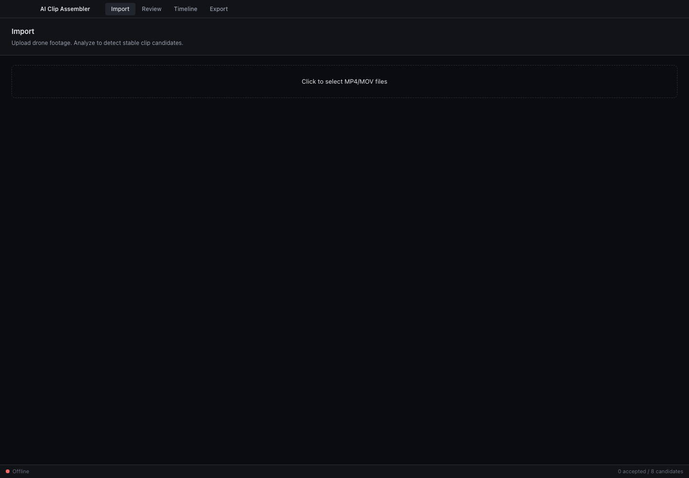
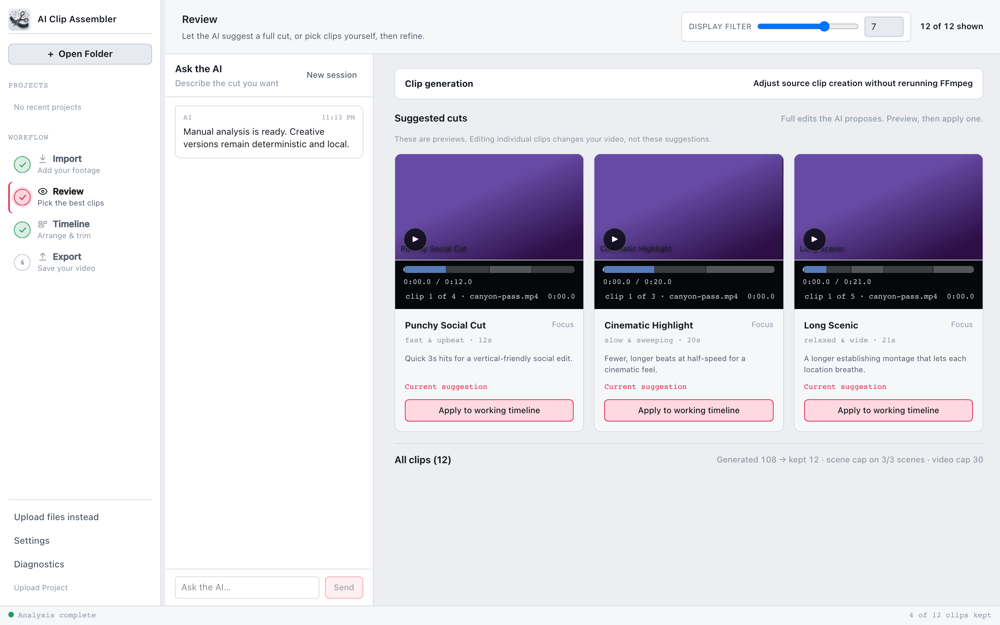
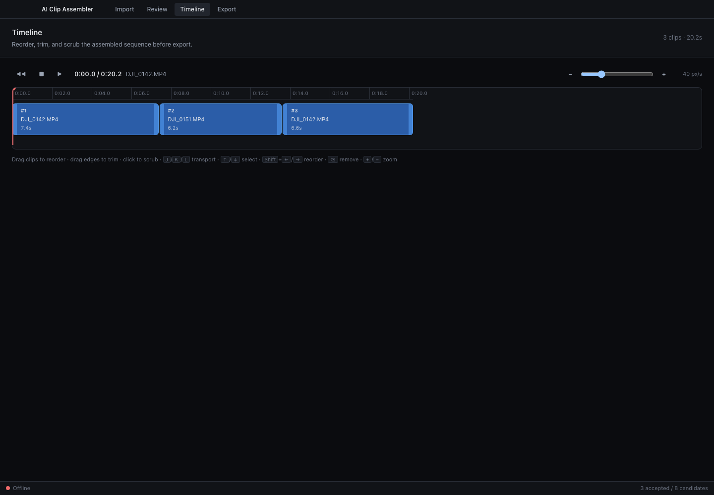
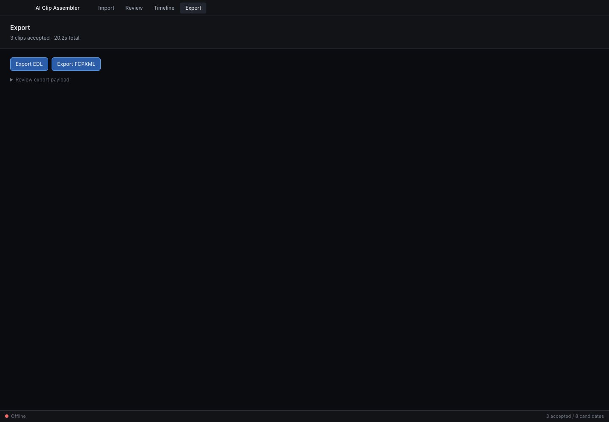

# User Guide

AI Clip Assembler turns raw drone/action footage into a tight 1–3 minute
cut. Import MP4/MOV files, review suggested clips, refine the Timeline, and
export to Final Cut Pro (FCPXML), DaVinci Resolve, or any EDL-reading editor.

The default `manual` harness stays local. Optional `pi_agent` sends selected
Frame Samples to its configured cloud provider for visual scoring only after
per-project consent; source videos stay on your machine.

> Screenshots live in `docs/images/`; update them when capturing a fresh build.

## Before you start

- macOS (Apple Silicon or Intel).
- Run the backend on `http://127.0.0.1:8000` and open the desktop app; see
  [DEVELOPER_SETUP.md](DEVELOPER_SETUP.md).
- **Online · v…** means the backend is reachable. **Offline** uses mock clips.

## The workflow

Four tabs, used left to right: **Import → Review → Timeline → Export**.

### 1. Import



1. Drop `.mp4`/`.mov` files. The local backend probes duration, FPS,
   resolution, and codec.
2. Click **Analyze**. The backend samples frames, measures technical quality,
   detects scenes, builds candidates, and optionally adds Pi visual scoring.
3. Continue when *“Analysis complete. Head to Review.”* appears.

The Source videos browser has three views: **Table** for complete metadata and
sorting, **Thumbs** for poster-style browsing, and **Compact** for a dense
filename list. Search, filter by analysis state, choose visible columns, and
select individual files or the whole batch without losing selection when the
view is filtered. The analysis rail reports the active phase, current video,
elapsed/remaining estimate, and Abort; analysis continues locally in the
background.

Analysis time scales with footage and harness; Pi makes a model call per clip.

**How clips are found** sets the rules for Candidate Clips: the shortest and
longest clip (3 s and 20 s by default), the smoothness and turn-rate limits,
and how many clips each Scene and each video may keep. A long steady stretch
gives several back-to-back clips, up to four per started minute of its Scene.
A project analyzed with an older version keeps the longest clip it was
analyzed with until you regenerate its clips.

### 2. Review



Candidates show metric chips and reasons. Adjust generation on Import; on
Review, filter by smoothness, browse Look Groups, choose Short/Medium/Long,
include/exclude clips, and reorder accepted clips. Excluded clips never enter
AI proposals.

Candidate Clips can be shown as **Grid** cards, a compact **List**, or a
**Filmstrip**. All three views keep the same Include/Remove decisions and
Timeline membership; List and Filmstrip use static poster surfaces so opening
Review does not eagerly mount a video for every candidate.

### Scripting in Review

Script mode gives you a Resolve-console-like way to edit the Timeline with Lua.
It runs against a copy, so nothing changes until you choose **Apply**; the
accepted Proposal is one Undo step. Switch the composer from **Message** to
**Script**, then press ⌘↩ to run. Review the change list, item counts and
durations, and the log before choosing **Apply** or **Discard**. If the Timeline
changed after a run, choose **Run again** to build a fresh Proposal. The Review
Agent can also reply with a script; it follows the same Run → Apply flow.
Writing or running a script needs no AI and no cloud consent.

The API uses 1-based indices and source seconds. Timeline and Item durations
include Speed.

| Area | Calls |
|---|---|
| Timeline | `timeline:items()`, `timeline:item(i)`, `timeline:count()`, `timeline:duration()`, `timeline:add(clip [, at])`, `timeline:clear()`, `timeline:set_target_duration(sec)`, `timeline:set_profile(name)` |
| Item | `item:id()`, `item:clip_id()`, `item:index()`, `item:source_in()`, `item:source_out()`, `item:speed()`, `item:duration()`, `item:transform()`, `item:trim(in, out)`, `item:split(at)`, `item:move(to)`, `item:set_speed(x)`, `item:reframe{scale=, x=, y=}`, `item:remove()` |
| Library | `library:clips{decision=...}`, `library:clip(id)`, `library:include(clip)`, `library:exclude(clip)`, `library:reset(clip)` |
| Log | `log(...)`, `print(...)` |

Keep each shot under 3 seconds, best first, and stop near 40 seconds:

```lua
local clips = library:clips{ decision = "included" }
table.sort(clips, function(a, b) return a.score > b.score end)
timeline:clear()
for _, clip in ipairs(clips) do
  local item = timeline:add(clip)
  if item:duration() > 3 then item:trim(item:source_in(), item:source_in() + 3) end
  if timeline:duration() >= 40 then break end
end
log(("%d shots, %.1fs"):format(timeline:count(), timeline:duration()))
```

Include every excluded Clip with a Smoothness Score of at least 7:

```lua
for _, clip in ipairs(library:clips{ decision = "excluded" }) do
  if clip.smoothness and clip.smoothness >= 7 then
    library:include(clip)
  end
end
log("Included excluded clips with smoothness >= 7")
```

Speed up each Timeline Item longer than 6 seconds to fit in 4 seconds, and log
each change:

```lua
for _, item in ipairs(timeline:items()) do
  local duration = item:duration()
  if duration > 6 then
    local speed = item:speed() * duration / 4
    item:set_speed(speed)
    log(("Item %d: %.1fs → 4.0s at %.2fx"):format(item:index(), duration, speed))
  end
end
```

Scripts have a 64 KiB source limit, a 2-second runtime, 16 MiB of Lua memory,
1,000 Operations, and 200 log lines of up to 500 characters each. They cannot
access files, the network, or frames. `string.match`, `string.gmatch`, and
`string.gsub` are unavailable; `string.find` searches plain text only.
DaVinci Resolve `DaVinciResolveScript` scripts do not run here.

### 3. Timeline



The page renders every backend Timeline Item in document order. Repeated uses
of one Candidate Clip remain separate items; each item's effective duration is
its source span divided by Speed. The visual track and Timeline editor mutate
the selected item by `item_id` through the backend Operations core. Speed and
Transform values are editable; full pan/crop preview remains pending visual
QA.

Reorder items, drag edges to trim, click to scrub, and zoom. Shortcuts:

| Key | Action |
|-----|--------|
| `L` / `K` / `J` | Forward / stop / reverse |
| `Space` | Play / pause |
| `←` / `→` | Move playhead ∓1s |
| `↑` / `↓` | Select previous / next Timeline Item |
| `Shift`+`←`/`→` | Move selected Timeline Item |
| `⌫` / `Delete` | Remove selected Timeline Item |
| `+` / `−` | Zoom in / out |

The studio Timeline has a selected-item Inspector alongside the track. Select
an item to edit its source bounds, Speed, and Transform, split or remove it,
and use the compact All items list to move between repeated placements.

### 4. Export



Choose Resolve XML, FCPXML, or EDL. Folder-project exports live under
`exports/{davinci,fcp,edl}` and link to original media with absolute `file://`
URLs. Keep the footage where it is, or reopen the moved project and export
again. Use **Review export
payload** to inspect every ordered Timeline Item before importing into your
NLE: repeated items, `item_id`, Candidate Clip and resolved file metadata, bounds,
Speed, and Transform are shown. Export reads the current backend Timeline
Document directly; it does not first save the Review page's legacy order or
trim projection. Each result keeps its file path, item count, export-time effective
duration, status, source media used duration (the unretimed sum of source ranges),
and warnings. EDL warns when Speed
or Transform was flattened; FCPXML and Resolve XML carry those supported values.
Existing-file exports ask for overwrite confirmation, and a Resolve XML result
offers **Open in DaVinci Resolve**.

Format cards make the handoff explicit. After export, the receipt preserves the
export-time item count, effective runtime, source media used duration, warnings,
generated path, and Copy/Reveal actions even if the Timeline changes afterward. EDL's
speed/transform caveat remains visible in the handoff summary and receipt.

## Choosing an AI harness

`manual` is local/default. `pi_agent` requires a configured provider and
per-project cloud consent. See
[HARNESS_SPEC.md](HARNESS_SPEC.md).

## Review model account (optional)

To use an OpenAI ChatGPT subscription through Pi:

1. Install a compatible Pi CLI. Open **Settings → Connections**; the Review
   model card reports ready, missing, or incompatible.
2. Choose **Sign in**, complete OpenAI authentication in the system browser,
   and return when the card says **Connected**. Use **Reconnect** after expiry
   and **Cancel** to stop a waiting flow.

Pi owns `~/.pi/agent/auth.json`; tokens never enter the renderer. Signing in
does not install Pi, select a harness, upload footage, or grant project consent.

## Connect your AI (optional)

Claude Desktop or Codex can inspect candidates and edit the already-analyzed
project currently open in the app. This MCP connection is separate from the
in-app Review model account.

In **Settings → Connections → Connect your AI**, each assistant reports
**Connected**, **Detected**, or **Config not found**. Click **Connect**; the app
backs up and updates its configuration, then asks you to restart the assistant.
If automatic setup fails, paste the displayed snippet manually.

Connected assistants can view candidates/frames and include, exclude, reorder,
trim, split, change speed, and undo/redo. They cannot trigger analysis. The app
must be open with a project loaded. Anything the assistant reads enters its
conversation under that provider's privacy policy; source video is not uploaded
by the app. See [MCP_SERVER.md](MCP_SERVER.md) for lower-level clients.

## Troubleshooting

See [TROUBLESHOOTING.md](TROUBLESHOOTING.md) for backend, FFmpeg, Pi sign-in,
OAuth callback, diagnostic, and export problems. Never share Pi auth contents,
OAuth URLs/codes, or tokens in logs or bug reports.
